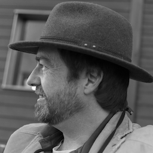

 <h2>Michael Welham</h2> 

  

- 20+ years professional software development
- led international development teams in Canada, United Kingdom and Germany.
- experience & expertise in real-time telecommunications, surveillance systems, multi-processing radar systems and iOS
- B.Sc. Computer Science (University of London)
- B.A. Philosophy (University of London)
- Patent: inventor for software surveillance system
- Programmed in many languages including Smalltalk, C, Algol 68, Fortran, Lisp, Protel, Objective C, Swift, and various assembly codes
- Swift and Smalltalk remain my favourites!
- Avid hiker - 20 years experience in the Alps & Europe, 10 years in Canada
 
 

 
<h3  class="red-text" style="text-align: center;"><a href="../privacy-policy/arcdale.com.html" style="color:#159957">Arcdale.com  Privacy Policy</a></h3>
 

<h2   style="text-align: center;">

</h2>
<h2   style="text-align: center;"><a href="/index.html" style="color:#159957">Main page</a></h2>

