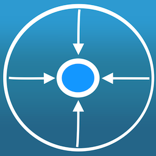
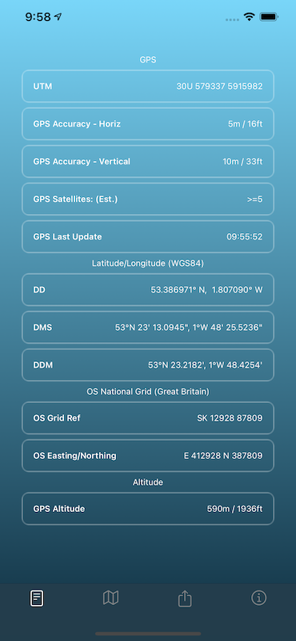
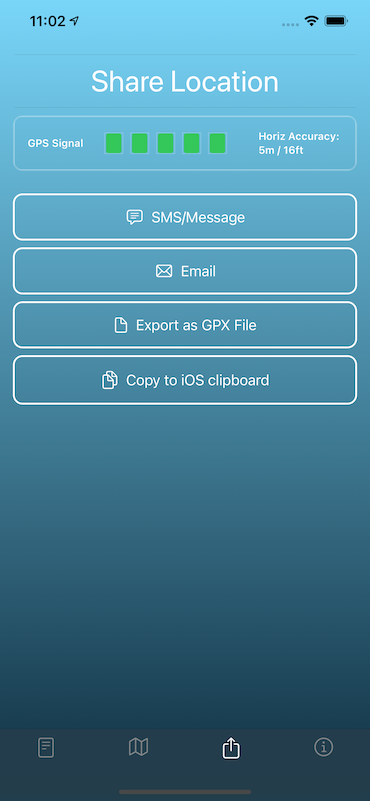
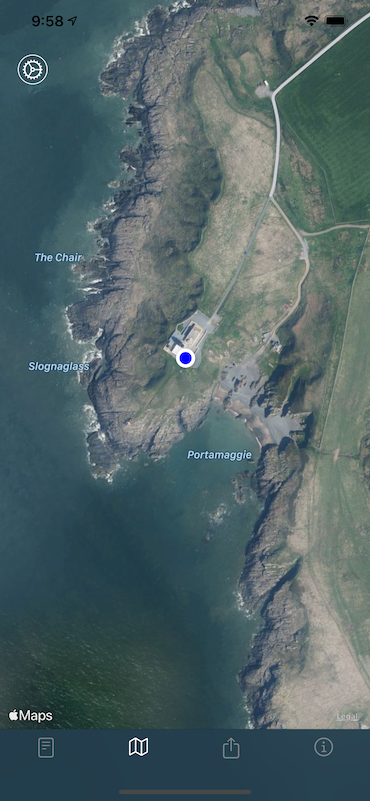

 <h2>MapSOS</h2> 

  

Determine your location in multiple coordinate formats on iPhone & iPad. Find your location on a paper map or chart, with a GPS device, smart phone, tablet or computer.

- UTM (GPS) coordinates
- Latitude/Longitude - DD, DMS, DDM (WGS84)
- Swiss Grid (CH1903 / CH1903+)
- OS National Grid - Great Britain (OSGB36)
- GPX files for use with apps and GPS receivers.
- Links to Apple Maps and Google Maps

  

Easily use & share your location information:-

- SMS/Message
- Email
- GPX file
- paste to iOS clipboard

  

Control in settings exactly which coordinates and information is included in SMS/Message and Emails.

MapSOS correctly reports coordinates for locations in all UTM grid zones including the non-standard UTM grid zones 31V/32V (western Norway), and Svalbard(31X,33X,35X,37X).

MapSOS requires GPS to precisely determine your location so is restricted to iPhone and iPad(Wi-Fi + Cellular).

<table>
  <tr>
    <td>Location Display</td>
     <td>Map</td>
     <td>Share Location</td>
  </tr>
  <tr>
    <td valign="top"><a href="MapSOSiPhoneP.png"/></td>
    <td valign="top"><a href="MapSOSGBMap.png"/></td>
    <td valign="top"><a href="MapSOS-Share.png"/></td>
  </tr>
 </table>

<h2  class="red-text" style="text-align: center;"><a href="https://apps.apple.com/us/app/mapsos/id1540411775"   target="_blank" style="color:#159957">MapSOS on iOS App Store</a></h2>
 

 

For support: 
<h3  class="red-text" style="text-align: center;"><a href="mailto:info@arcdale.com" style="color:#159957">info@arcdale.com</a></h3>

 
<h3  class="red-text" style="text-align: center;"><a href="../privacy-policy/MapSOS.html" style="color:#159957">MapSOS Privacy Policy</a></h3>

 

<h2   style="text-align: center;"><a href="/index.html" style="color:#159957">Arcdale Software</a></h2>

