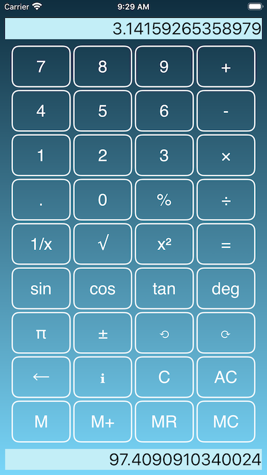

 <h2>SomeSum Calculator (Universal iOS App) </h2> 

  

- Calculator with undo / redo 

- Dual main and memory displays 

- Multiple themes

- Support for iOS 13 dark mode/light mode

- Left-handed / right-handed landscape modes
  - select the landscape layout most suited to your dominant hand

- Local regional decimal separator can be overriden in settings
 
- iPad version adds
  - statistical functions
  - hyperbolic, inverse trigonometric and inverse hyperbolic functions
  - dice and random functions

[SomeSum on iOS App Store](https://apps.apple.com/us/app/somesum/id1503184279#?platform=iphone)

For support: [info@arcdale.com](mailto:info@arcdale.com)    

-  [SomeSum Privacy Policy](SomeSumPrivacyPolicy.md)	
