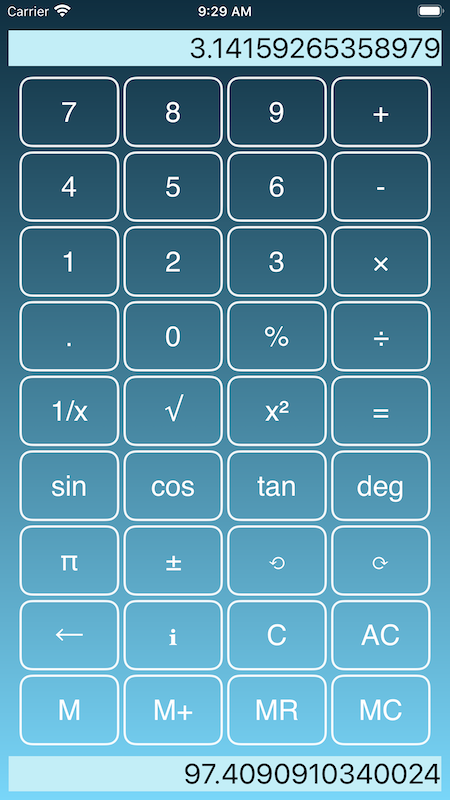

 <h2>SomeSum Calculator - macOS,  iOS (iPad - iPhone - iPod) </h2> 

  

# Features
 
<dl>
  <dt>Calculator with undo / redo</dt>
  <dd>Check & correct your calculations. No more re-entering everything after a single mistake.</dd>
  <dt>Dual main and memory displays</dt>
  <dd>Work more quickly - see both the main calculator value and the memory value.</dd>
  <dt>Multiple Themes</dt>
  <dd>Including support for dark mode</dd> 
  <dt>Copy/paste from both displays</dt>
  <dd>Paste in values from other apps, and copy your results to emails, text editors, and other apps.</dd>
  <dt>macOS version</dt>
  <dd>Includes keyboard support, Mac menus, preferences, full Mac help</dd>
  <dt>iOS version</dt>
  <dd>Left-handed / right-handed landscape modes, in-app help, in-app settings</dd>
</dl>

  

- iPad version adds
  - statistical functions
  - hyperbolic, inverse trigonometric and inverse hyperbolic functions
  - dice and random functions

Includes standard calculator operations, and also:-

### Trigonometric Functions  (macOS,iOS)

sin - sine function
cos - cosine function
tan - tangent function

### Inverse Trigonometric Functions (macOS,iPadOS)

sin⁻¹ - arcsin / inverse sine
cos⁻¹ - arccos / inverse cosine
tan⁻¹ - arctan / inverse tangent

## Hyperbolic Functions  (macOS,iPadOS)

sinh - hyperbolic sine
cosh - hyperbolic cosine
tanh - hyperbolic tangent

## Inverse Hyperbolic Functions  (macOS,iPadOS)

sinh⁻¹ - arcsinh/inverse hyperbolic sine
cosh⁻¹ - arccosh/inverse hyperbolic cosine
tanh⁻¹ - arctanh/inverse hyperbolic tangent

## Extended calculator functions for macOS / iPad

abs/int/fract/modulo

Dedicated buttons for π, ln, log₂, log₁₀, √, ∛, ∜, x√, x², x³, xⁿ, 2ⁿ, 8ⁿ, 10ⁿ, 16ⁿ, ℯ, ℯⁿ

Random/dice - generate random numbers, and simulate a 6-sided dice

Temperature conversions

and more ...

<h2  class="red-text" style="text-align: center;"><a href="https://apps.apple.com/us/app/mapsos/id1503184279" target="_blank" style="color:#159957">SomeSum on iOS App Store</a></h2>
 

 

For support: 
<h3  class="red-text" style="text-align: center;"><a href="mailto:info@arcdale.com" style="color:#159957">info@arcdale.com</a></h3>

 
<h3  class="red-text" style="text-align: center;"><a href="../privacy-policy/SomeSum.html" style="color:#159957">SomeSum Privacy Policy</a></h3>

 

<h2   style="text-align: center;"><a href="/index.html" style="color:#159957">Arcdale Software</a></h2>
