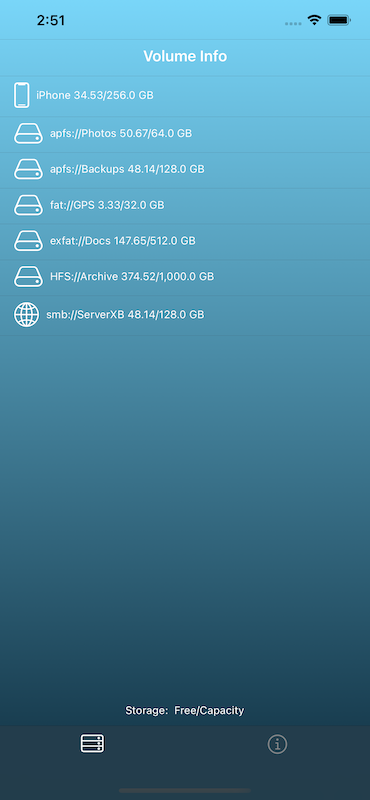

 <h2>myVolumeInfo (Universal iOS App) </h2> 

  

Displays free space/capacity for USB mounted volumes: APFS, HFS, ExFat, Fat - also SMB Shares

Quickly see the file system type,  free space and capacity for each of your USB mounted volumes.

As per iOS 14 support for USB mounted volumes, the following unencrypted file systems are supported:-

- APFS
- HFS
- Fat
- ExFat

Encrypted APFS volumes are shown once they have been accessed via the iOS Files app.
SMB shares are shown once they have been accessed via the iOS Files app.

Free space/capacity are shown by default, alternatively can show used space/capacity.

myVolumeInfo, the iOS app that provides an overview of your connected USB drives.

For support: [info@arcdale.com](mailto:info@arcdale.com)    

[myVolume Privacy Policy](privacy-policy/myVolumeInfo.md)	

 <h2>SomeSum Calculator (Universal iOS App) </h2> 

  

- Calculator with undo / redo 

- Dual main and memory displays 

- Multiple themes

- Support for iOS 13 dark mode/light mode

- Left-handed / right-handed landscape modes
  - select the landscape layout most suited to your dominant hand

- Local regional decimal separator can be overridden in settings
 
- iPad version adds
  - statistical functions
  - hyperbolic, inverse trigonometric and inverse hyperbolic functions
  - dice and random functions

[SomeSum on iOS App Store](https://apps.apple.com/us/app/somesum/id1503184279#?platform=iphone)

For support: [info@arcdale.com](mailto:info@arcdale.com)    

[SomeSum Privacy Policy](privacy-policy/SomeSum.md)	

[arcdale.com](http://www.arcdale.com)

