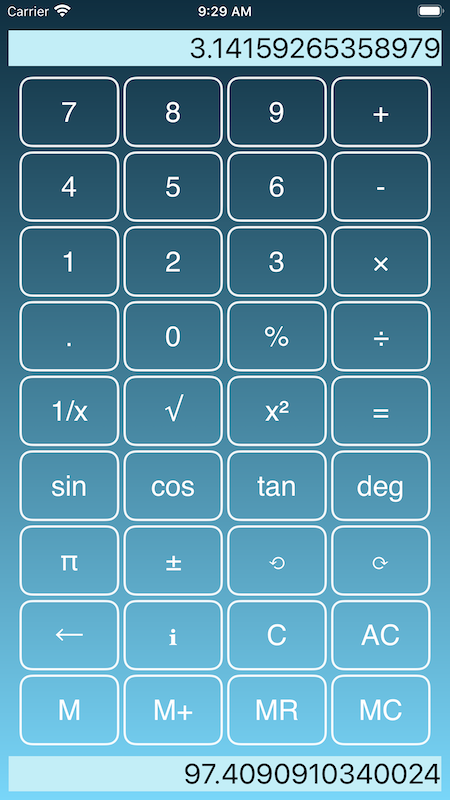

 <h2>MapSOS</h2> 

  

Determine your location in multiple coordinate formats to allow it to be found by iPhone or iPad, on a paper map or chart, or with a GPS device, smart phone, tablet or computer.

- UTM (GPS) coordinates
- Latitude/Longitude (DD, DMS, DDM)
- Swiss Grid (CH1903 / CH1903+)
- OS National Grid - Great Britain (OSGB36)
- GPX files for use with apps and GPS receivers.
- Links to Apple Maps and Google Maps

Easily use & share your location information:-

- SMS/Message
- Email
- GPX file
- paste to iOS clipboard

Control in settings exactly which coordinates and information is included in SMS/Message and Emails.

MapSOS correctly reports coordinates for locations in all UTM grid zones including the non-standard UTM grid zones 31V/32V (western Norway), and Svalbard(31X,33X,35X,37X).

MapSOS requires GPS to precisely determine your location so is restricted to iPhone and iPad(Wi-Fi + Cellular).

[MapSOS on iOS App Store](https://apps.apple.com/us/app/mapsos/id1540411775)

For support: [info@arcdale.com](mailto:info@arcdale.com)    

[MapSOS Privacy Policy](privacy-policy/MapSOS.md)	

 <h2>myVolumeInfo (Universal iOS App) </h2> 

  

Displays free space/capacity for USB mounted volumes: APFS, HFS, ExFat, Fat - also SMB Shares

Quickly see the file system type,  free space and capacity for each of your USB mounted volumes.

As per iOS 14 support for USB mounted volumes, the following unencrypted file systems are supported:-

- APFS
- HFS
- Fat
- ExFat

Encrypted APFS volumes are shown once they have been accessed via the iOS Files app.
SMB shares are shown once they have been accessed via the iOS Files app.

Free space/capacity are shown by default, alternatively can show used space/capacity.

myVolumeInfo, the iOS app that provides an overview of your connected USB drives.

[myVolumeInfo on iOS App Store](https://apps.apple.com/us/app/myvolumeinfo/id1535600468)

For support: [info@arcdale.com](mailto:info@arcdale.com)    

[myVolumeInfo Privacy Policy](privacy-policy/myVolumeInfo.md)	

 <h2>SomeSum Calculator (Universal iOS App) </h2> 

  

- Calculator with undo / redo 

- Dual main and memory displays 

- Multiple themes

- Support for iOS 13 dark mode/light mode

- Left-handed / right-handed landscape modes
  - select the landscape layout most suited to your dominant hand

- Local regional decimal separator can be overridden in settings
 
- iPad version adds
  - statistical functions
  - hyperbolic, inverse trigonometric and inverse hyperbolic functions
  - dice and random functions

[SomeSum on iOS App Store](https://apps.apple.com/us/app/somesum/id1503184279)

For support: [info@arcdale.com](mailto:info@arcdale.com)    

[SomeSum Privacy Policy](privacy-policy/SomeSum.md)	

[arcdale.com](http://www.arcdale.com)

